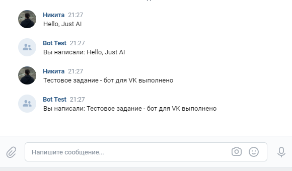
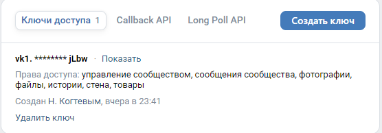

# VK Бот

VK Бот - это простое приложение для взаимодействия с API ВКонтакте. Он прослушивает входящие события от ВК и обрабатывает их соответственно.

## Описание

Этот бот выполняет цитирование присланного ему текста.


## Используемые библиотеки

- Spring Boot
- Log4j
- Jackson
- Apache HttpClient

## Конфигурация

1. **application.properties**

   Параметры конфигурации приложения хранятся в файле `src/main/resources/application.properties`. Здесь вы можете настроить секретные ключи, токены доступа и другие параметры для взаимодействия с API ВКонтакте.

    ```properties
      server.port=ВАШ_ПОРТ
      secretKey=ВАШ_СЕКРЕТНЫЙ_КЛЮЧ
      confirmationToken=ВАШ_ТОКЕН_ПОДТВЕРЖДЕНИЯ
      accessToken=ВАШ_ТОКЕН_ДОСТУПА
    ```
   Получение конфигурации осуществляется в настройках сообщества.
    
## Сборка проекта

Используйте Gradle для сборки проекта.


